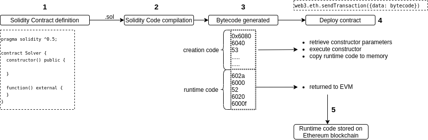

# MagicNumber

## 题目描述

[原题 in Sepolia](https://ethernaut.openzeppelin.com/level/0x2132C7bc11De7A90B87375f282d36100a29f97a9)

用10个字节码返回一个数字

## 运行

根据[Foundry 官方文档](https://getfoundry.sh/)配置好运行环境后，于本项目下执行下列命令：

```sh
$ cd WTF-CTF

$ forge test -C src/Ethernaut/MagicNumber -vvvvv
```

## 功能简述

题目要求我们写一个solver合约，solver合约会对MagicNum合约的whatIsTheMeaningOfLife()合约间调用返回42（0x2a）。但是要求solver合约最多只有10个操作码。

```solidity
// 该合约有119个字节码, when Enable optimization 200
contract Solver{
    function whatIsTheMeaningOfLife() public pure returns (bytes32) {
        return bytes32(uint256(42));
    }
}
```

所以，我们只能通过opcode进行编码。

#### 合约部署到区块链上的流程：

1. 用户或者合约发布一个部署合约交易到区块链上，这笔交易与普通的转账交易不同的是，该交易的to字段为空，即没有交易的接收者。这样来告诉EVM这是一笔合约部署，合约信息存储在msg.data中。
2. evm对solidity的代码进行编译，编译成字节码，该字节码中包含initialization code和runtime code.
3. 在合约创建过程中，EVM 只执行initialization code。只执行constructor()函数，此时合约的codesize等于0
4. 将runtime code复制到内存中并返回到 EVM。
5. EVM 将返回的runtime code与新的合约地址关联后存储

[](https://github.com/Big-Aaron/ethernaut/blob/main/18.MagicNumber/contractCreationWorkflow.png)

1. Runtime code，要把42放冰箱总共分几步？

    | (bytes) | OPCODE   | Stack (left to right => top to bottom) | Meaning                               | bytecode |
    | ------- | :------- | -------------------------------------- | ------------------------------------- | -------- |
    | 00      | PUSH1 2a |                                        | 将 44压入堆栈                         | 602a     |
    | 02      | PUSH1 00 | 2a                                     | 将 0 压入堆栈                         | 6000     |
    | 05      | MSTORE   | 00, 2a                                 | 将数字42存储到memory内存中0字节的位置 | 52       |
    | 06      | PUSH1 20 |                                        | 将 32 压入堆栈                        | 6020     |
    | 08      | PUSH1 00 | 20                                     | 将 0 压入堆栈                         | 6000     |
    | 10      | RETURN   | 00, 20                                 | 返回存储在内存位置 0 的 32 个字节     | f3       |

     10 个字节的 OPCODES 的汇编产生以下字节码：`602a60005260206000f3`

2. initialization code，创建代码我们要执行以下内容

    | (bytes) | OPCODE                      | Stack (left to right = top to bottom) | Meaning                                                      | bytecode               |
    | ------- | --------------------------- | ------------------------------------- | ------------------------------------------------------------ | ---------------------- |
    | 00      | PUSH10 602a60005260206000f3 |                                       | 将 10 个字节的运行时字节码压入堆栈，                         | 69602a60005260206000f3 |
    | 03      | PUSH 00                     | 602a60005260206000f3                  | 将 0 压入堆栈                                                | 6000                   |
    | 05      | MSTORE                      | 0, 602a60005260206000f3               | 将10 个字节的运行时字节码到memory内存中0字节的位置，这将`602a60005260206000f3`在左侧填充 22 个零以形成 32 字节长的字节串。 | 52                     |
    | 06      | PUSH a                      |                                       | 将 10 压入堆栈                                               | 600a                   |
    | 08      | PUSH 16                     | a                                     | 将 22 压入堆栈                                               | 6016                   |
    | 10      | RETURN                      | 16, a                                 | 返回存储在内存位置 22 的 10 个字节                           | f3                     |

    完整的合约创建字节码`69602a60005260206000f3600052600a6016f3`


不过，我们也可以只定义Runtime code的字节码，让solidity帮我部署

```solidity
constructor() {
	assembly {
		mstore(0x00, 0x602a60005260206000f3)
		return(0x16, 0x0a)
	}
}
```

如果熟悉Huff，也可以部署huff合约

```solidity
#define macro MAIN() = takes(0) returns(0) {
    
    // store 42 in memory at offset 0
    0x2a    // [42]
    0x00    // [0,42]
    mstore  // []

    // return 42
    // return 32 bytes of memory starting at offset 0
    0x20    // [32]
    0x00    // [0,32]
    return  // []
}
```

